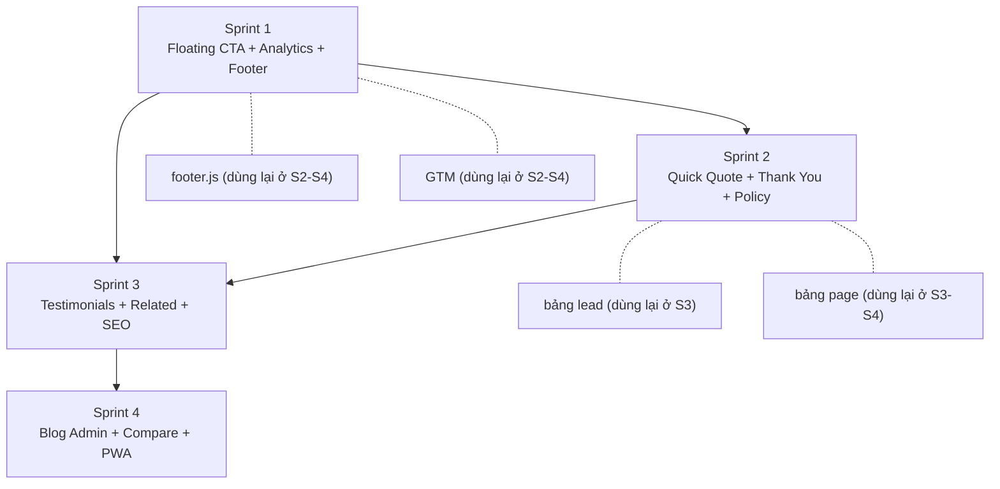

# 📋 KẾ HOẠCH THỰC THI (Implementation Plan)
## Website Băng Keo Vũ Gia Phát — D2C

> **Tài liệu tham chiếu:** [PRD_Bangkeo_VuGiaPhat.md](file:///c:/Doan/CODE_MAU/Bangkeo_VuGiaPhat/.agents/PRD_Bangkeo_VuGiaPhat.md)  
> **Ngày lập:** 01/10/2026

---

## Quy ước ký hiệu

| Ký hiệu | Ý nghĩa |
|---|---|
| ✅ **Đã có** | File đã tồn tại, hoạt động đúng, không cần thay đổi trong phase này |
| ✏️ **Chỉnh sửa** | File đã tồn tại, cần chỉnh sửa/bổ sung code |
| 🆕 **Tạo mới** | File chưa tồn tại, cần tạo từ đầu |
| 🗄️ **DB** | Thao tác trên Supabase Dashboard (tạo bảng, thêm cột, RLS) |

---

## SPRINT 1 — Nền tảng chuyển đổi & Đo lường
> **Thời gian:** 1–2 ngày · **Ưu tiên:** 🔴 Khẩn cấp  
> **Mục tiêu:** Thêm các điểm chạm chuyển đổi cơ bản nhất (Zalo/Hotline nổi) + cài đặt hệ thống đo lường + tối ưu cấu trúc code

### Danh sách file

| # | Trạng thái | File | Mô tả chức năng | Công việc cần thực hiện |
|---|---|---|---|---|
| 1 | 🆕 | `js/footer.js` | Inject HTML footer bằng `document.write()`, tương tự `header.js` | Tạo file mới. Trích xuất toàn bộ HTML `<footer>` từ `index.html` thành template JS. Chuẩn hóa bản quyền: "© 2024 VŨ GIA PHÁT". Giữ `data-setting-*` attributes để render động. |
| 2 | 🆕 | `sitemap.xml` | Danh sách URL cho search engine crawl | Tạo file XML liệt kê tất cả URL: `index.html`, `products.html`, `about.html`, `blog.html`, `contact.html`, `privacy-policy.html`, `terms-of-service.html`, `return-policy.html`. Mỗi URL có `<lastmod>`, `<changefreq>`, `<priority>`. |
| 3 | 🆕 | `robots.txt` | Hướng dẫn cho crawler | Tạo file: `Allow: /`, `Disallow: /admin/`, `Sitemap: https://domain.com/sitemap.xml`. |
| 4 | ✏️ | [`css/style.css`](file:///c:/Doan/CODE_MAU/Bangkeo_VuGiaPhat/css/style.css) | File CSS chính | Thêm styles cho: `.floating-cta` (nút Zalo/Hotline nổi, fixed bottom-right/left), `.floating-cta .pulse` (animation nhấp nháy), responsive ẩn/hiện trên mobile. |
| 5 | ✏️ | [`js/main.js`](file:///c:/Doan/CODE_MAU/Bangkeo_VuGiaPhat/js/main.js) | Logic frontend chính | **a)** Thêm hàm `renderFloatingCTA()`: inject HTML nút Zalo + Hotline nổi vào `<body>`, lấy link Zalo/SĐT từ bảng `settings`. **b)** Thêm hàm `trackEvent(name, params)`: wrapper gọi `gtag()` và `fbq()` cho event tracking. **c)** Gọi `renderFloatingCTA()` trong `DOMContentLoaded`. |
| 6 | ✏️ | [`index.html`](file:///c:/Doan/CODE_MAU/Bangkeo_VuGiaPhat/index.html) | Trang chủ | **a)** Xóa toàn bộ block `<footer>...</footer>` cũ, thay bằng ``. **b)** Thêm GTM container snippet vào `<head>` và `<body>`. **c)** Sửa đóng tag modal QuickView (thiếu `
` ở dòng 340–343). |
| 7 | ✏️ | [`products.html`](file:///c:/Doan/CODE_MAU/Bangkeo_VuGiaPhat/products.html) | Trang danh sách sản phẩm | Xóa block `<footer>` cũ → thay ``. Thêm GTM snippet. |
| 8 | ✏️ | [`product-detail.html`](file:///c:/Doan/CODE_MAU/Bangkeo_VuGiaPhat/product-detail.html) | Trang chi tiết sản phẩm | Xóa block `<footer>` cũ → thay ``. Thêm GTM snippet. |
| 9 | ✏️ | [`cart.html`](file:///c:/Doan/CODE_MAU/Bangkeo_VuGiaPhat/cart.html) | Trang giỏ hàng | Xóa block `<footer>` cũ → thay ``. Thêm GTM snippet. |
| 10 | ✏️ | [`about.html`](file:///c:/Doan/CODE_MAU/Bangkeo_VuGiaPhat/about.html) | Trang giới thiệu | Xóa block `<footer>` cũ → thay ``. Thêm GTM snippet. |
| 11 | ✏️ | [`blog.html`](file:///c:/Doan/CODE_MAU/Bangkeo_VuGiaPhat/blog.html) | Trang blog | Xóa block `<footer>` cũ → thay ``. Thêm GTM snippet. |
| 12 | ✏️ | [`contact.html`](file:///c:/Doan/CODE_MAU/Bangkeo_VuGiaPhat/contact.html) | Trang liên hệ | Xóa block `<footer>` cũ → thay ``. Thêm GTM snippet. |
| 13 | ✅ | [`js/header.js`](file:///c:/Doan/CODE_MAU/Bangkeo_VuGiaPhat/js/header.js) | Header + Navbar | Không thay đổi. |
| 14 | ✅ | [`js/supabase-config.js`](file:///c:/Doan/CODE_MAU/Bangkeo_VuGiaPhat/js/supabase-config.js) | Cấu hình Supabase | Không thay đổi. |

### Database (Supabase Dashboard)

| # | Trạng thái | Bảng | Thao tác |
|---|---|---|---|
| 1 | 🗄️ | `settings` | Thêm record key `gtm_id` (Google Tag Manager ID), `fb_pixel_id` (Facebook Pixel ID), `zalo_link` (nếu chưa có). |

### Checklist hoàn thành Sprint 1
- [x] Nút Zalo nổi hiển thị góc phải dưới trên mọi trang, có pulse animation
- [x] Nút Hotline nổi hiển thị trên mobile (góc trái dưới)
- [x] Click Zalo mở link Zalo OA / Zalo cá nhân
- [x] Footer đồng bộ 100% trên tất cả trang (qua `footer.js`)
- [x] GTM container nhúng trên mọi trang
- [x] GA4 nhận được page_view events
- [x] Facebook Pixel fire PageView trên mọi trang
- [x] `sitemap.xml` và `robots.txt` tồn tại ở thư mục gốc
- [ ] Google Search Console submit sitemap thành công

---

## SPRINT 2 — Tối ưu phễu thu thập Lead
> **Thời gian:** 3–5 ngày · **Ưu tiên:** 🔴 Quan trọng  
> **Mục tiêu:** Thêm các kênh thu thập lead mới (Quick Quote, Thank You Page) + nội dung pháp lý bắt buộc + thông báo khuyến mãi

### Danh sách file

| # | Trạng thái | File | Mô tả chức năng | Công việc cần thực hiện |
|---|---|---|---|---|
| 1 | 🆕 | `thank-you.html` | Trang xác nhận sau khi gửi form/đặt hàng | Tạo trang mới gồm: Tiêu đề "Cảm ơn bạn!", tóm tắt thông tin đã gửi (đọc từ `sessionStorage`), hướng dẫn bước tiếp theo, CTA "Quay lại trang chủ" / "Xem thêm sản phẩm". Nhúng GTM, `header.js`, `footer.js`. Gọi `gtag('event', 'generate_lead')` và `fbq('track', 'Lead')`. |
| 2 | 🆕 | `privacy-policy.html` | Trang chính sách bảo mật | Tạo trang mới. Layout: Breadcrumb + nội dung HTML lấy từ bảng `page` (slug = `privacy-policy`). Fallback: nội dung tĩnh hardcode. Nhúng `header.js`, `footer.js`, GTM. |
| 3 | 🆕 | `terms-of-service.html` | Trang điều khoản dịch vụ | Tương tự `privacy-policy.html`, slug = `terms-of-service`. |
| 4 | 🆕 | `return-policy.html` | Trang chính sách đổi trả | Tương tự `privacy-policy.html`, slug = `return-policy`. |
| 5 | 🆕 | `admin/js/page-pages.js` | Admin: Quản lý trang tĩnh | Tạo module admin CRUD cho bảng `page`. Giao diện: danh sách trang → click → form chỉnh sửa nội dung HTML (textarea hoặc simple rich-text). Fields: slug (readonly), title, content (HTML). |
| 6 | ✏️ | [`css/style.css`](file:///c:/Doan/CODE_MAU/Bangkeo_VuGiaPhat/css/style.css) | CSS chính | Thêm styles cho: `.quick-quote-modal` (popup slide-in), `.announcement-bar` (thanh thông báo trên cùng, background màu vàng/cam, nút đóng X), `.thank-you-hero` (section thành công). |
| 7 | ✏️ | [`js/main.js`](file:///c:/Doan/CODE_MAU/Bangkeo_VuGiaPhat/js/main.js) | Logic frontend chính | **a)** Thêm hàm `renderQuickQuoteModal()`: Inject modal form báo giá nhanh (SĐT + Dropdown SP + SL). Trigger: hiện sau 30s hoặc scroll 50% trên trang `products.html`/`product-detail.html`. Check `localStorage` để không hiện lại trong 24h. Submit lưu vào bảng `lead`. **b)** Thêm hàm `renderAnnouncementBar()`: Lấy notice mới nhất (is_active) từ bảng `notices` (đã có), hiển thị ở trên cùng trang. Nút X đóng, lưu `sessionStorage`. **c)** Sửa `submitContactForm()`: Redirect đến `thank-you.html` sau khi gửi thành công (lưu info vào sessionStorage). **d)** Sửa `submitOrder()`: Redirect đến `thank-you.html` sau khi đặt hàng thành công. |
| 8 | ✏️ | [`contact.html`](file:///c:/Doan/CODE_MAU/Bangkeo_VuGiaPhat/contact.html) | Trang liên hệ | Cập nhật 3 link chính sách ở footer từ `href="#"` thành `href="privacy-policy.html"`, `href="terms-of-service.html"`, `href="return-policy.html"`. (Lưu ý: Sau Sprint 1, footer đã component hóa nên chỉ cần sửa `footer.js`). |
| 9 | ✏️ | [`js/footer.js`](file:///c:/Doan/CODE_MAU/Bangkeo_VuGiaPhat/js/footer.js) | Footer component | Cập nhật 3 link chính sách từ `href="#"` thành URL thực. |
| 10 | ✏️ | [`admin/js/app.js`](file:///c:/Doan/CODE_MAU/Bangkeo_VuGiaPhat/admin/js/app.js) | Admin SPA routing | Thêm route `#/pages` → load `page-pages.js`. Thêm menu item "Trang nội dung" vào sidebar. |
| 11 | ✅ | [`admin/index.html`](file:///c:/Doan/CODE_MAU/Bangkeo_VuGiaPhat/admin/index.html) | Admin SPA shell | Không thay đổi (routing xử lý trong `app.js`). |

### Database (Supabase Dashboard)

| # | Trạng thái | Bảng | Thao tác |
|---|---|---|---|
| 1 | 🗄️ 🆕 | `lead` | Tạo bảng: `id` (uuid, PK), `name` (text), `phone` (text, NOT NULL), `email` (text), `source` (text: popup/quick-quote/landing), `product_interest` (text), `quantity_estimate` (text), `status` (text: new/contacted/converted, default: new), `created_at` (timestamptz). RLS: INSERT anon, SELECT/UPDATE/DELETE admin only. |
| 2 | 🗄️ 🆕 | `page` | Tạo bảng: `id` (uuid, PK), `slug` (text, UNIQUE), `title` (text), `content` (text/HTML), `updated_at` (timestamptz). RLS: SELECT public, UPDATE/INSERT/DELETE admin only. Seed 3 records: `privacy-policy`, `terms-of-service`, `return-policy` với nội dung mẫu. |

### Checklist hoàn thành Sprint 2
- [x] Form báo giá nhanh (popup) hiện sau 30s trên trang sản phẩm
- [x] Popup không hiện lại trong 24h (localStorage check)
- [x] Submit Quick Quote lưu vào bảng `lead` thành công
- [x] Submit Contact form redirect đến `thank-you.html`
- [x] Submit Order redirect đến `thank-you.html`
- [x] Thank You Page fire GA4 `generate_lead` + Pixel `Lead` event
- [x] 3 trang chính sách hiển thị nội dung từ DB
- [x] Admin có thể chỉnh sửa nội dung 3 trang chính sách
- [x] Announcement bar hiển thị thông báo từ bảng `notices`
- [x] Announcement bar có thể đóng (X), không hiện lại trong session
- [x] Footer links chính sách trỏ đúng URL

---

## SPRINT 3 — Xây dựng uy tín & Tối ưu SEO
> **Thời gian:** 1 tuần · **Ưu tiên:** 🟡 Tối ưu  
> **Mục tiêu:** Tăng trust (testimonials) + cross-sell (sản phẩm liên quan) + bảng giá sỉ + SEO nâng cao

### Danh sách file

| # | Trạng thái | File | Mô tả chức năng | Công việc cần thực hiện |
|---|---|---|---|---|
| 1 | 🆕 | `admin/js/page-testimonials.js` | Admin: CRUD đánh giá KH | Tạo module admin. Giao diện: danh sách testimonials → form thêm/sửa. Fields: `customer_name`, `company_name`, `content`, `rating` (1-5 stars selector), `avatar` (upload ảnh), `is_featured` (toggle), `is_active`, `sort_order`. |
| 2 | 🆕 | `admin/js/page-leads.js` | Admin: Quản lý Lead | Tạo module admin. Giao diện: bảng danh sách lead với cột (tên, SĐT, email, source, SP quan tâm, SL, status, ngày). Bộ lọc: source, status. Nút thay đổi status (new → contacted → converted). Nút Export CSV. |
| 3 | ✏️ | [`index.html`](file:///c:/Doan/CODE_MAU/Bangkeo_VuGiaPhat/index.html) | Trang chủ | **a)** Thêm section "Khách hàng nói gì" (carousel testimonials) sau section "Số liệu". Container `
` do `main.js` render. **b)** Thêm section "Đối tác tiêu biểu" (logo grid) — có thể hardcode hoặc từ `settings`. |
| 4 | ✏️ | [`js/main.js`](file:///c:/Doan/CODE_MAU/Bangkeo_VuGiaPhat/js/main.js) | Logic frontend chính | **a)** Thêm hàm `renderTestimonials()`: Fetch từ bảng `testimonial` (is_featured = true, is_active = true), render carousel Bootstrap 5 với tên, công ty, nội dung, rating sao. **b)** Thêm hàm `renderRelatedProducts(categoryId, currentProductId)`: Fetch 4 SP cùng category (trừ SP hiện tại), render card grid. **c)** Thêm hàm `renderRecentlyViewed()`: Đọc mảng product IDs từ `localStorage('recentProducts')`, fetch và render strip 4 SP. **d)** Thêm hàm `saveRecentlyViewed(productId)`: Push ID vào array localStorage (max 10, FIFO). |
| 5 | ✏️ | [`product-detail.html`](file:///c:/Doan/CODE_MAU/Bangkeo_VuGiaPhat/product-detail.html) | Trang chi tiết sản phẩm | **a)** Thêm section "Bảng giá sỉ theo số lượng" (`
`) sau block giá hiện tại. **b)** Thêm section "Sản phẩm liên quan" (`
`) cuối trang. **c)** Thêm section "Bạn đã xem gần đây" (`
`) cuối trang. |
| 6 | ✏️ | [`js/product-detail.js`](file:///c:/Doan/CODE_MAU/Bangkeo_VuGiaPhat/js/product-detail.js) | Logic chi tiết SP | **a)** Thêm hàm `renderPriceTiers(tiers)`: Đọc `price_tiers` (JSON) từ product data, render bảng giá (SL | Giá/cuộn | Chiết khấu). **b)** Gọi `saveRecentlyViewed(productId)` khi load trang. **c)** Gọi `renderRelatedProducts()` và `renderRecentlyViewed()` sau khi render xong SP chính. **d)** Thêm nút "Chia sẻ" (Zalo, Facebook, Copy Link). |
| 7 | ✏️ | [`js/seo.js`](file:///c:/Doan/CODE_MAU/Bangkeo_VuGiaPhat/js/seo.js) | Schema Markup & SEO | **a)** Thay đổi `SEO_DATA` hardcode → fetch từ bảng `category` (cột `seo_title`, `seo_description`, `seo_article`). **b)** Thêm `generateLocalBusinessJSONLD()`: Schema `LocalBusiness` cho trang about/contact. **c)** Thêm `generateOrganizationJSONLD()`: Schema `Organization` (logo, URL) trên mọi trang. **d)** Thêm `generateBreadcrumbJSONLD()`: Schema `BreadcrumbList`. **e)** Thêm `generateFAQJSONLD()`: Schema `FAQPage` cho tab chính sách trên product-detail. |
| 8 | ✏️ | [`contact.html`](file:///c:/Doan/CODE_MAU/Bangkeo_VuGiaPhat/contact.html) | Trang liên hệ | Thay bản đồ CSS placeholder bằng Google Maps `<iframe>` embed (src lấy từ bảng `settings`, key `google_maps_url`). Thêm `loading="lazy"`. Giữ fallback CSS khi iframe fail. |
| 9 | ✏️ | [`css/style.css`](file:///c:/Doan/CODE_MAU/Bangkeo_VuGiaPhat/css/style.css) | CSS chính | Thêm styles cho: `.testimonial-card`, `.testimonial-carousel`, `.price-tiers-table`, `.related-products`, `.recently-viewed`, `.share-buttons`. |
| 10 | ✏️ | [`admin/js/app.js`](file:///c:/Doan/CODE_MAU/Bangkeo_VuGiaPhat/admin/js/app.js) | Admin SPA routing | Thêm route `#/testimonials` → load `page-testimonials.js`. Thêm route `#/leads` → load `page-leads.js`. Thêm 2 menu items vào sidebar. |
| 11 | ✏️ | [`admin/js/page-products.js`](file:///c:/Doan/CODE_MAU/Bangkeo_VuGiaPhat/admin/js/page-products.js) | Admin: Quản lý SP | Thêm UI quản lý `price_tiers` trong form sản phẩm: bảng dynamic (thêm/xóa hàng) cho min, max, price. Serialize thành JSON khi save. |
| 12 | ✏️ | [`admin/js/page-categories.js`](file:///c:/Doan/CODE_MAU/Bangkeo_VuGiaPhat/admin/js/page-categories.js) | Admin: Quản lý danh mục | Thêm 3 fields SEO vào form danh mục: `seo_title` (input), `seo_description` (textarea), `seo_article` (textarea HTML). |
| 13 | ✅ | [`admin/js/page-notices.js`](file:///c:/Doan/CODE_MAU/Bangkeo_VuGiaPhat/admin/js/page-notices.js) | Admin: Quản lý thông báo | Không thay đổi (đã có, phục vụ Announcement Bar ở Sprint 2). |

### Database (Supabase Dashboard)

| # | Trạng thái | Bảng | Thao tác |
|---|---|---|---|
| 1 | 🗄️ 🆕 | `testimonial` | Tạo bảng: `id` (uuid, PK), `customer_name` (text), `company_name` (text), `content` (text), `rating` (int, 1-5), `avatar` (text, URL), `is_featured` (bool, default false), `is_active` (bool, default true), `sort_order` (int), `created_at` (timestamptz). RLS: SELECT public, CUD admin. Seed 3-5 testimonials mẫu. |
| 2 | 🗄️ ✏️ | `category` | Thêm 3 cột: `seo_title` (text), `seo_description` (text), `seo_article` (text). |
| 3 | 🗄️ ✏️ | `product` | Thêm cột: `price_tiers` (jsonb, nullable). |
| 4 | 🗄️ ✏️ | `settings` | Thêm record key `google_maps_url` (Google Maps embed URL). |

### Checklist hoàn thành Sprint 3
- [x] Trang chủ hiển thị section "Khách hàng nói gì" với 3+ testimonials
- [x] Admin có thể CRUD testimonials, toggle featured/active
- [x] Admin có thể quản lý Lead (xem, lọc, đổi status, export CSV)
- [x] Trang product-detail hiển thị bảng giá sỉ (nếu có `price_tiers`)
- [x] Trang product-detail hiển thị 4 sản phẩm liên quan
- [x] Trang product-detail hiển thị "Đã xem gần đây"
- [x] Nút chia sẻ (Zalo, FB, Copy Link) hoạt động trên product-detail
- [x] SEO data lấy từ DB (`category.seo_*`) thay vì hardcode
- [x] Schema `LocalBusiness` render trên about/contact
- [x] Schema `BreadcrumbList` render trên mọi trang có breadcrumb
- [x] Google Maps iframe hiển thị trên trang liên hệ
- [x] Admin chỉnh sửa được SEO fields cho danh mục
- [x] Admin quản lý `price_tiers` cho sản phẩm

---

## SPRINT 4 — Mở rộng nội dung & Công cụ nâng cao
> **Thời gian:** 2 tuần · **Ưu tiên:** 🟢 Mở rộng  
> **Mục tiêu:** Hoàn thiện hệ thống blog + popup lead magnet + so sánh SP + PWA

### Danh sách file

| # | Trạng thái | File | Mô tả chức năng | Công việc cần thực hiện |
|---|---|---|---|---|
| 1 | 🆕 | `admin/js/page-posts.js` | Admin: CRUD bài viết blog | Tạo module admin. Giao diện: danh sách bài viết (title, status, date) → form thêm/sửa. Fields: `title`, `slug` (auto-generate từ title), `excerpt`, `content` (textarea HTML/rich text), `image` (upload), `category_tag`, `is_published` (toggle), `published_at`, `seo_title`, `seo_description`. Preview link. |
| 2 | 🆕 | `compare.html` | Trang so sánh sản phẩm | Tạo trang mới. Đọc danh sách product IDs từ `localStorage('compareList')`. Fetch data từ Supabase. Render bảng so sánh side-by-side: Ảnh, Tên, Giá, Thông số (độ dày, chiều dài, trọng lượng, keo dính, đóng gói), MOQ, Rating. Tối đa 4 SP. Nút "Xóa" từng SP, nút "Xóa tất cả". Nhúng `header.js`, `footer.js`, GTM. |
| 3 | 🆕 | `manifest.json` | PWA manifest | Tạo file: `name`, `short_name` ("VGP Tape"), `start_url` ("/"), `display` ("standalone"), `theme_color` (var --brand), `background_color`, `icons` (logo 192x192, 512x512). |
| 4 | 🆕 | `sw.js` | Service Worker cơ bản | Tạo file: Cache static assets (CSS, JS, logo, fonts) khi install. Serve from cache first, network fallback. Chỉ cache file tĩnh, không cache API calls. |
| 5 | 🆕 | `js/compare.js` | Logic trang so sánh | Tạo file: `getCompareList()` đọc `localStorage`, `addToCompare(id)` thêm vào list (max 4), `removeFromCompare(id)`, `renderCompareTable()` fetch & render bảng. Export hàm `addToCompare` cho card sản phẩm gọi. |
| 6 | ✏️ | [`js/main.js`](file:///c:/Doan/CODE_MAU/Bangkeo_VuGiaPhat/js/main.js) | Logic frontend chính | **a)** Thêm hàm `renderLeadMagnetPopup()`: Popup "Nhận báo giá + giảm 5%" sau 10s lần đầu truy cập. Fields: SĐT + Email (tùy chọn). Check cookie 7 ngày. Submit lưu bảng `lead` (source = 'popup'). **b)** Thêm nút "So sánh" trên product card: icon so sánh, toggle active, badge đếm trên header. **c)** Register Service Worker nếu `'serviceWorker' in navigator`. |
| 7 | ✏️ | [`js/blog.js`](file:///c:/Doan/CODE_MAU/Bangkeo_VuGiaPhat/js/blog.js) | Logic trang blog | Cập nhật để fetch từ bảng `post` (Supabase) thay vì data hardcode (nếu đang hardcode). Filter `is_published = true`. Pagination hoặc "Xem thêm". Render card: ảnh bìa, title, excerpt, date, category_tag. |
| 8 | ✏️ | [`js/post.js`](file:///c:/Doan/CODE_MAU/Bangkeo_VuGiaPhat/js/post.js) | Logic chi tiết bài viết | Cập nhật để fetch bài viết theo `slug` hoặc `id` từ query string. Render title, content (HTML), date, author. Cập nhật `<title>` và `<meta description>` động từ `seo_title`, `seo_description`. Gọi `generateArticleJSONLD()`. |
| 9 | ✏️ | [`js/seo.js`](file:///c:/Doan/CODE_MAU/Bangkeo_VuGiaPhat/js/seo.js) | Schema Markup | Thêm `generateArticleJSONLD(post)`: Schema `Article` cho bài viết blog. |
| 10 | ✏️ | [`js/header.js`](file:///c:/Doan/CODE_MAU/Bangkeo_VuGiaPhat/js/header.js) | Header + Navbar | Thêm icon "So sánh" vào thanh icon (cạnh cart/bell): `<a href="compare.html"><i class="bi bi-arrows-angle-expand"></i>0</a>`. |
| 11 | ✏️ | [`css/style.css`](file:///c:/Doan/CODE_MAU/Bangkeo_VuGiaPhat/css/style.css) | CSS chính | Thêm styles cho: `.compare-table`, `.compare-btn` (trên card SP), `.lead-magnet-popup`, `.lead-magnet-overlay`. |
| 12 | ✏️ | [`admin/js/app.js`](file:///c:/Doan/CODE_MAU/Bangkeo_VuGiaPhat/admin/js/app.js) | Admin SPA routing | Thêm route `#/posts` → load `page-posts.js`. Thêm menu item "Bài viết" vào sidebar. |

### Database (Supabase Dashboard)

| # | Trạng thái | Bảng | Thao tác |
|---|---|---|---|
| 1 | 🗄️ 🆕 | `post` | Tạo bảng: `id` (uuid, PK), `title` (text), `slug` (text, UNIQUE), `excerpt` (text), `content` (text/HTML), `image` (text, URL), `category_tag` (text), `author` (text), `is_published` (bool, default false), `published_at` (timestamptz), `seo_title` (text), `seo_description` (text), `created_at` (timestamptz). RLS: SELECT public (where is_published=true), CUD admin only. Seed 2-3 bài viết mẫu. |

### Checklist hoàn thành Sprint 4
- [ ] Admin có thể CRUD bài viết blog (draft/published)
- [ ] Blog page fetch bài viết từ Supabase (không hardcode)
- [ ] Post page render bài viết với Article Schema
- [ ] Popup Lead Magnet hiện sau 10s cho khách mới
- [ ] Popup không hiện lại trong 7 ngày (cookie check)
- [ ] Submit popup lưu vào bảng `lead` (source = 'popup')
- [ ] Nút "So sánh" hiển thị trên card sản phẩm
- [ ] Trang `compare.html` render bảng so sánh side-by-side
- [ ] `manifest.json` hợp lệ (test bằng Chrome DevTools → Application)
- [ ] Service Worker cache static assets
- [ ] Khách có thể "Add to Home Screen" trên mobile

---

## Tổng hợp toàn bộ Sprint

### Thống kê file

| Metric | Sprint 1 | Sprint 2 | Sprint 3 | Sprint 4 | **Tổng** |
|---|---|---|---|---|---|
| 🆕 File tạo mới | 3 | 5 | 2 | 5 | **15** |
| ✏️ File chỉnh sửa | 9 | 5 | 9 | 7 | **30** |
| 🗄️ Bảng DB mới | 0 | 2 | 1 | 1 | **4** |
| 🗄️ Bảng DB sửa | 1 | 0 | 3 | 0 | **4** |

### Dependency Graph

> [!IMPORTANT]
> **Sprint 1 là prerequisite** của tất cả Sprint sau. `footer.js` và GTM container phải hoàn thành trước để Sprint 2–4 sử dụng.
> Sprint 3 phụ thuộc Sprint 2 vì cần bảng `lead` đã tạo để module `page-leads.js` hoạt động.
